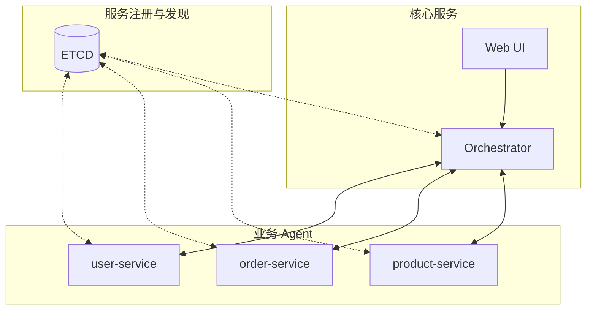

# AI-Nexus

Go 语言的多 Agent 协作框架，让你用最少的代码把普通服务变成 AI Agent，支持 Agent 之间的自动发现与智能协作。

## 架构



## 快速开始

### 环境要求

- Go 1.21+
- ETCD 3.5+（用于服务发现）
- OpenAI API Key（或兼容接口）

### 启动服务

```bash
# 1. 启动 ETCD
etcd

# 2. 设置环境变量
export OPENAI_API_KEY="your-api-key"
export OPENAI_BASE_URL="https://api.openai.com/v1"  # 可选，默认 OpenAI

# 3. 一键启动所有服务
./scripts/dev-start.sh

# 4. 访问 Web UI
open http://localhost:8090
```

### 停止服务

```bash
./scripts/dev-stop.sh
```

## 服务端口

| 服务 | 端口 | 说明 |
|------|------|------|
| Web UI | 8090 | 群聊界面 |
| Orchestrator | 8080 | 智能协调器 |
| user-service | 8081 | 用户服务 Agent |
| order-service | 8082 | 订单服务 Agent |
| product-service | 8083 | 商品服务 Agent |

## 核心概念

### Agent

Agent 是具备 AI 能力的业务服务。每个 Agent 可以：
- 注册 Tool（函数）供 AI 调用
- 通过 ETCD 自动注册和发现其他 Agent
- 处理来自 Orchestrator 或其他 Agent 的任务

### Orchestrator

Orchestrator 是智能协调器，负责：
- 分析用户请求，规划执行步骤
- 路由请求到合适的 Agent
- 汇总多个 Agent 的结果

### Tool

Tool 是 Agent 暴露给 AI 的函数。通过反射自动生成 JSON Schema：

```go
type QueryUserInput struct {
    UserID   int64  `json:"user_id,omitempty" desc:"用户ID"`
    Username string `json:"username,omitempty" desc:"用户名"`
}

func (s *UserStore) QueryUser(ctx context.Context, input *QueryUserInput) (string, error) {
    // 业务逻辑
}
```

### Session

Session 是群聊会话，记录用户和多个 Agent 之间的对话历史。

## 目录结构

```
ai-nexus/
├── cmd/                    # 服务入口
│   ├── orchestrator/       # 协调器服务
│   ├── web-ui/             # Web UI 服务
│   ├── user-service/       # 用户服务示例
│   ├── order-service/      # 订单服务示例
│   └── product-service/    # 商品服务示例
│
├── pkg/                    # 框架核心
│   ├── agent/              # Agent 核心
│   │   ├── agent.go        # Agent 结构和生命周期
│   │   ├── handler.go      # 任务处理（LLM + Tool 调用）
│   │   ├── server.go       # HTTP 服务
│   │   └── config.go       # 配置加载
│   │
│   ├── orchestrator/       # 协调器
│   │   ├── orchestrator.go # 核心逻辑
│   │   ├── planner.go      # 任务规划（LLM）
│   │   ├── executor.go     # 任务执行
│   │   └── summarizer.go   # 结果汇总
│   │
│   ├── protocol/           # 协议定义
│   │   ├── types.go        # 消息、会话等类型
│   │   ├── events.go       # 流式事件类型
│   │   └── agent.go        # Agent Card 定义
│   │
│   ├── session/            # 会话存储
│   │   ├── interface.go    # Store 接口
│   │   ├── memory.go       # 内存实现
│   │   └── redis.go        # Redis 实现
│   │
│   ├── tools/              # Tool 注册
│   │   └── registry.go     # 反射扫描和执行
│   │
│   ├── llm/                # LLM 客户端
│   │   ├── interface.go    # 接口定义
│   │   └── openai.go       # OpenAI 实现
│   │
│   └── registry/           # 服务注册
│       ├── interface.go    # 接口定义
│       └── etcd.go         # ETCD 实现
│
└── scripts/                # 脚本
    ├── dev-start.sh        # 启动所有服务
    └── dev-stop.sh         # 停止所有服务
```

## 开发指南

### 创建新的 Agent

1. 创建配置文件 `config.yaml`：

```yaml
name: "my-service"
display_name: "我的服务"
description: "提供 XXX 功能"
version: "1.0.0"
host: "localhost"
port: 8084

llm:
  api_key: "${OPENAI_API_KEY}"
  base_url: "${OPENAI_BASE_URL}"
  model: "gpt-4o-mini"

registry:
  type: "etcd"
  endpoints:
    - "localhost:2379"
  prefix: "/ai-nexus/agents"
  ttl: 30
```

2. 编写 `main.go`：

```go
package main

import (
    "github.com/AdrianWangs/ai-nexus/pkg/agent"
)

func main() {
    agent.RunAgent("./config.yaml", func(ag *agent.Agent) error {
        // 注册 Tool
        return ag.RegisterToolFunc("my_tool", "工具描述", myService.MyTool)
    })
}
```

3. 定义 Tool 函数：

```go
type MyToolInput struct {
    Param1 string `json:"param1" desc:"参数1说明"`
    Param2 int    `json:"param2,omitempty" desc:"参数2说明（可选）"`
}

func (s *MyService) MyTool(ctx context.Context, input *MyToolInput) (string, error) {
    // 业务逻辑
    return "结果", nil
}
```

### 配置说明

| 配置项 | 说明 | 默认值 |
|--------|------|--------|
| `name` | Agent 唯一标识 | 必填 |
| `display_name` | 显示名称 | 同 name |
| `description` | Agent 描述（用于 LLM 路由决策） | - |
| `port` | 服务端口 | 必填 |
| `llm.api_key` | OpenAI API Key | 必填 |
| `llm.base_url` | API 地址 | https://api.openai.com/v1 |
| `llm.model` | 模型名称 | gpt-4o-mini |
| `registry.endpoints` | ETCD 地址 | - |
| `registry.ttl` | 注册 TTL（秒） | 30 |

## API 文档

### Web UI API

| 端点 | 方法 | 说明 |
|------|------|------|
| `/api/sessions` | GET | 获取会话列表 |
| `/api/sessions` | POST | 创建新会话 |
| `/api/sessions/:id` | GET | 获取会话详情 |
| `/api/sessions/:id` | DELETE | 删除会话 |
| `/api/sessions/:id/messages` | GET | 获取会话消息 |
| `/api/chat` | POST | 发送消息（SSE 流式响应） |
| `/api/agents` | GET | 获取在线 Agent 列表 |
| `/api/sse?session_id=xxx` | GET | SSE 订阅 |

### A2A 协议端点

每个 Agent 暴露以下端点：

| 端点 | 方法 | 说明 |
|------|------|------|
| `/a2a/tasks` | POST | 处理任务（非流式） |
| `/a2a/tasks/stream` | POST | 处理任务（流式） |
| `/a2a/card` | GET | 获取 Agent Card |
| `/a2a/capabilities` | GET | 获取能力列表 |
| `/a2a/tools` | GET | 获取 Tool 列表 |
| `/health` | GET | 健康检查 |

### 流式事件类型

| 类型 | 说明 |
|------|------|
| `message_start` | 消息开始 |
| `content_delta` | 内容片段 |
| `message_end` | 消息结束 |
| `tool_call` | 工具调用 |
| `tool_result` | 工具结果 |
| `agent_call` | 调用其他 Agent |
| `agent_result` | Agent 返回结果 |
| `thinking` | 思考过程 |
| `status` | 状态更新 |
| `done` | 流结束 |
| `error` | 错误 |

## 使用示例

### 基本对话

```
用户: 帮我查一下张三的订单

[orchestrator] 分析请求，规划执行步骤...
[orchestrator] → @user-service: 查询用户名为张三的用户信息
[user-service] 调用 Tool: query_user({"username": "张三"})
[user-service] → @orchestrator: 用户ID: 123, 姓名: 张三

[orchestrator] → @order-service: 查询用户ID为123的订单
[order-service] 调用 Tool: list_orders({"user_id": 123})
[order-service] → @orchestrator: 找到3个订单...

[orchestrator] → 用户: 张三有3个订单：1. iPhone 15... 2. MacBook...
```

### 直接 @Agent

```
用户: @product-service 查询所有商品

[product-service] 调用 Tool: list_products({})
[product-service] → 用户: 共有5个商品：1. iPhone 15 Pro ¥7999...
```

## License

MIT
