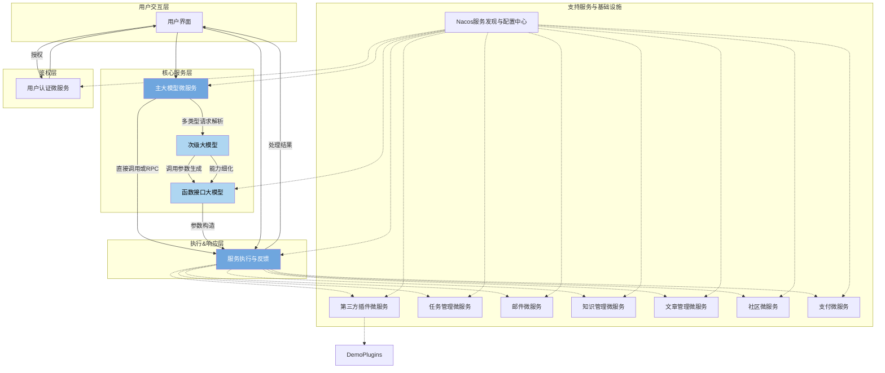
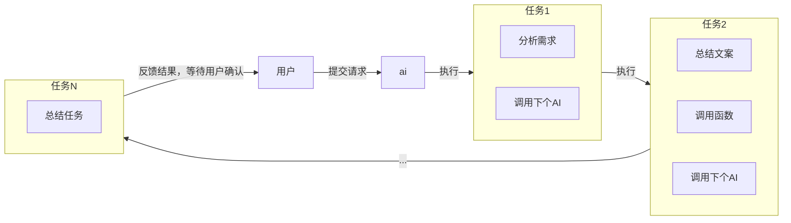
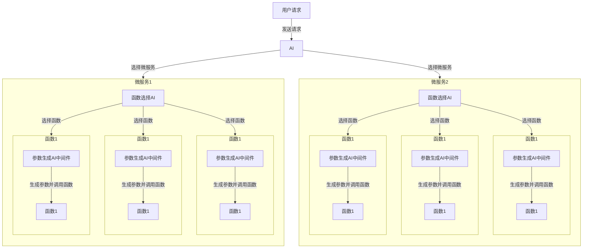
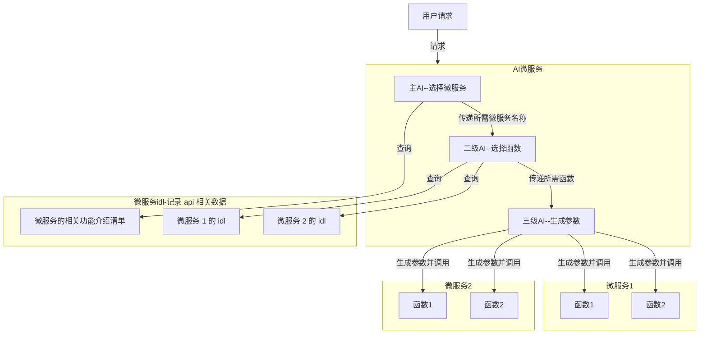

# 项目架构图

## 总架构图

### **模块构成与工作流**

1. **用户界面与主大模型微服务**
    - **用户交互层**：用户通过API接口提交请求，包含自然语言表述的需求。
    - **核心入口——主大模型**：这是系统的第一道处理环节，负责理解与解析用户需求，确定最佳的服务路径。主大模型具备高级的语义理解和决策能力，决定哪些模块微服务最适合响应特定需求。

2. **模块微服务与次级大模型**
    - 每个微服务作为一个“能力模块”，入口配置了另一层大模型，此模型专注识别服务请求类型并映射到合适的内部服务或函数。
    - **需求细化**：次级大模型进一步分析细化用户的具体要求，明确应当调用哪个功能模块及其接口。
    - **调用参数构造**：确定调用需求后，该模型自动生成调用相应接口所需的参数集，确保准确传达用户的意图。

3. **函数接口大模型与服务执行**
    - 最深层次的模型专注于实现调用的细节，包括参数化和错误处理。
    - **判断与反馈**：基于前序分析，此模型验证需求是否符合其管理的接口功能，并作出响应。符合条件则动态生成调用参数；如遇无法处理的情况，则返回精确的错误信息。

4. **主大模型微服务的执行层**
    - 配备了双重调用机制：既能直接通过反射机制执行本地方法，又能通过RPC（远程过程调用）框架与其他微服务通信。
    - **服务调度**：基于分析结果及生成的参数，核心微服务高效地发起实际函数调用，完成用户请求的处理并返回结果。

## 功能架构

### ai 微服务

#### 用户视角

#### 开发视角逻辑架构

#### 开发视角物理架构

