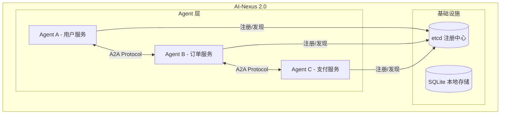
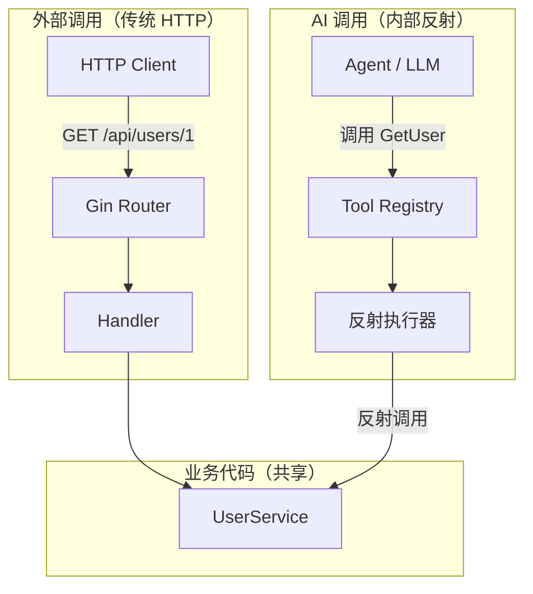
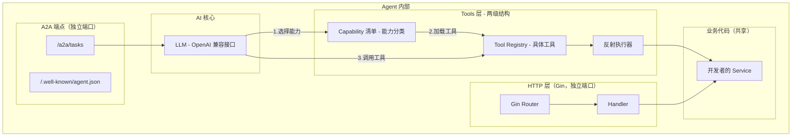
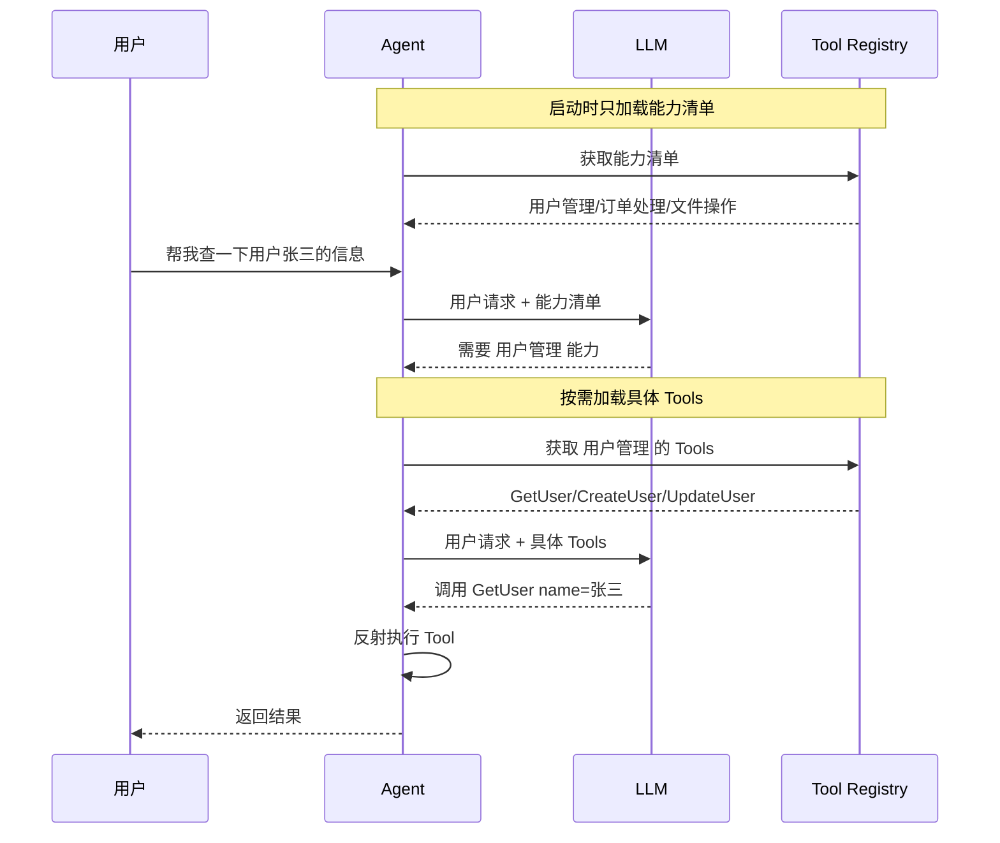
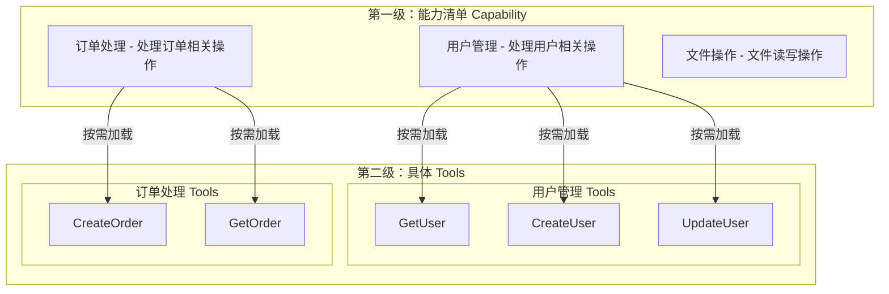
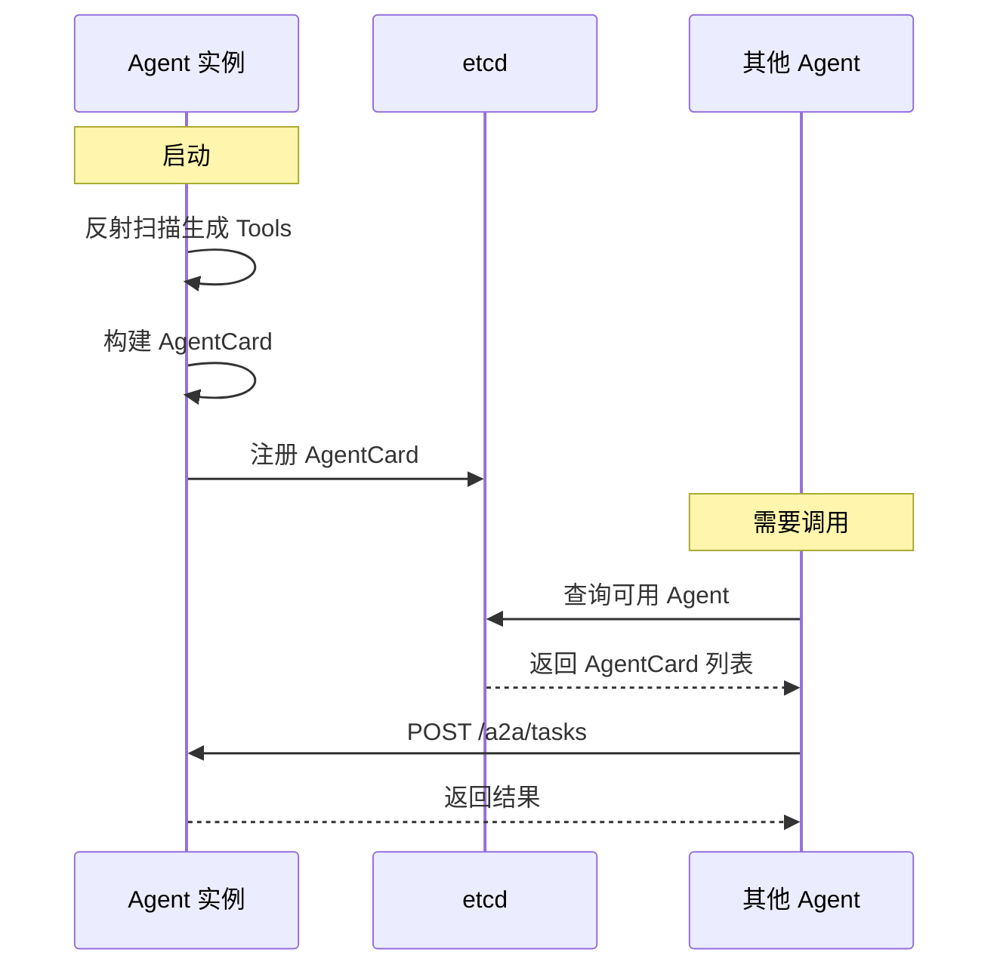

## AI-Nexus 2.0 MVP 方案

### 项目愿景

一个 Go 语言的 Agent 开发框架，让开发者用最少的代码把普通服务变成 AI Agent，支持 Agent 之间的发现与协作。

---

## 核心架构



### 两种调用路径（HTTP vs AI）



**关键点**：
- **Gin 是 Gin** - 对外的 HTTP 接口，正常的 REST API
- **AI 调用是 AI 调用** - 内部通过反射直接调用 Service 方法
- **Service 是共享的** - 两边都调用同一个业务代码

### 单个 Agent 内部结构



---

## 懒加载 Tools 机制

AI 一开始只知道"能力清单"，按需加载具体 Tools，节省 Token 并提高灵活性。



### 两级结构设计



---

## 服务发现流程



---

## Tool 描述方式（混合模式）

```go
// 用结构体 + Tag 定义输入参数
type GetUserInput struct {
    UserID int64  `json:"user_id" desc:"用户的唯一标识"`
    Name   string `json:"name" desc:"用户姓名，可选"`
}

type UserService struct{}

func (s *UserService) GetUser(input GetUserInput) (*User, error) {
    return &User{ID: input.UserID}, nil
}

// 实现接口提供方法描述
func (s *UserService) ToolDescriptions() map[string]string {
    return map[string]string{
        "GetUser":    "根据用户ID或姓名获取用户详细信息",
        "CreateUser": "创建新用户账号",
    }
}
```

---

## YAML 配置文件

元信息通过 YAML 配置，无需重新编译即可修改：

```yaml
# config.yaml
agent:
  name: "user-service"
  description: "用户管理服务，提供用户增删改查功能"
  version: "1.0.0"
  
server:
  http_port: 8080    # Gin HTTP 端口
  a2a_port: 8081     # A2A 协议端口
  
llm:
  base_url: "https://api.openai.com/v1"
  api_key: "${OPENAI_API_KEY}"
  model: "gpt-4o-mini"
  
registry:
  etcd_endpoints:
    - "localhost:2379"
    
capabilities:
  - name: "user-management"
    description: "用户管理，包括用户的增删改查操作"
  - name: "order-management"
    description: "订单管理，包括订单的创建和查询"
```

---

## MVP 目录结构

```
ai-nexus/
├── cmd/
│   └── example/              # 示例入口
├── pkg/
│   ├── agent/                # Agent 核心
│   │   ├── agent.go          # Agent 结构
│   │   ├── options.go        # 配置选项
│   │   ├── config.go         # YAML 配置加载
│   │   └── card.go           # AgentCard
│   ├── tools/                # 反射工具层
│   │   ├── capability.go     # 能力定义（第一级）
│   │   ├── scanner.go        # 反射扫描
│   │   ├── schema.go         # JSON Schema 生成
│   │   └── executor.go       # 执行器
│   ├── a2a/                  # A2A 协议
│   │   ├── server.go         # HTTP 端点
│   │   ├── client.go         # 调用其他 Agent
│   │   └── types.go          # 类型定义
│   ├── llm/                  # LLM 层
│   │   └── openai.go         # OpenAI 兼容接口
│   └── registry/             # 注册中心
│       └── etcd.go           # etcd 实现
└── examples/                 # 示例（Gin + Mock 数据）
    ├── user-service/         # 用户服务示例
    ├── order-service/        # 订单服务示例
    └── product-service/      # 商品服务示例
```

---

## 示例服务（Gin + Mock 数据）

### 1. 用户服务 (user-service)

```go
// examples/user-service/service.go
type UserService struct{}

type GetUserInput struct {
    UserID int64 `json:"user_id" desc:"用户ID"`
}

func (s *UserService) GetUser(input GetUserInput) (*User, error) {
    return &User{
        ID:    input.UserID,
        Name:  "张三",
        Email: "zhangsan@example.com",
        Phone: "13800138000",
    }, nil
}

func (s *UserService) ListUsers(input ListUsersInput) ([]*User, error) {
    return []*User{
        {ID: 1, Name: "张三"},
        {ID: 2, Name: "李四"},
        {ID: 3, Name: "王五"},
    }, nil
}

func (s *UserService) ToolDescriptions() map[string]string {
    return map[string]string{
        "GetUser":   "根据用户ID获取用户详细信息",
        "ListUsers": "获取用户列表",
    }
}
```

### 2. 订单服务 (order-service)

```go
// examples/order-service/service.go
type OrderService struct{}

type CreateOrderInput struct {
    UserID    int64 `json:"user_id" desc:"用户ID"`
    ProductID int64 `json:"product_id" desc:"商品ID"`
    Quantity  int   `json:"quantity" desc:"购买数量"`
}

func (s *OrderService) CreateOrder(input CreateOrderInput) (*Order, error) {
    return &Order{
        ID:        10001,
        UserID:    input.UserID,
        ProductID: input.ProductID,
        Quantity:  input.Quantity,
        Amount:    99.99,
        Status:    "pending",
        CreatedAt: time.Now(),
    }, nil
}

func (s *OrderService) GetOrder(input GetOrderInput) (*Order, error) {
    return &Order{
        ID:     input.OrderID,
        Status: "completed",
        Amount: 199.99,
    }, nil
}

func (s *OrderService) ToolDescriptions() map[string]string {
    return map[string]string{
        "CreateOrder": "创建新订单",
        "GetOrder":    "查询订单详情",
    }
}
```

### 3. 商品服务 (product-service)

```go
// examples/product-service/service.go
type ProductService struct{}

func (s *ProductService) GetProduct(input GetProductInput) (*Product, error) {
    return &Product{
        ID:          input.ProductID,
        Name:        "iPhone 15 Pro",
        Price:       7999.00,
        Stock:       100,
        Description: "Apple 最新款智能手机",
    }, nil
}

func (s *ProductService) SearchProducts(input SearchInput) ([]*Product, error) {
    return []*Product{
        {ID: 1, Name: "iPhone 15 Pro", Price: 7999.00},
        {ID: 2, Name: "MacBook Pro", Price: 14999.00},
        {ID: 3, Name: "AirPods Pro", Price: 1899.00},
    }, nil
}

func (s *ProductService) ToolDescriptions() map[string]string {
    return map[string]string{
        "GetProduct":     "获取商品详情",
        "SearchProducts": "搜索商品",
    }
}
```

### 示例启动方式

```go
// examples/user-service/main.go
func main() {
    // 共享的业务服务
    userService := &UserService{}
    
    // 1. Gin 路由（对外 HTTP，端口 8080）
    r := gin.Default()
    r.GET("/api/users/:id", func(c *gin.Context) {
        id, _ := strconv.ParseInt(c.Param("id"), 10, 64)
        user, _ := userService.GetUser(GetUserInput{UserID: id})
        c.JSON(200, user)
    })
    r.GET("/api/users", func(c *gin.Context) {
        users, _ := userService.ListUsers(ListUsersInput{})
        c.JSON(200, users)
    })
    
    // 2. Agent（AI 调用，端口 8081）
    ag := agent.NewFromConfig("./config.yaml")
    ag.RegisterCapability("user-management", "用户管理")
    ag.RegisterService("user-management", userService)
    
    // 并行启动两个服务
    go r.Run(":8080")  // HTTP API
    ag.Run(":8081")    // A2A 端点
}
```

---

## MVP 实施步骤

### 第一步：反射工具层
- `pkg/tools/capability.go` - 能力定义
- `pkg/tools/scanner.go` - 扫描 struct 方法 + Tag
- `pkg/tools/schema.go` - 生成 JSON Schema
- `pkg/tools/executor.go` - 反射调用方法

### 第二步：LLM 集成
- `pkg/llm/openai.go` - OpenAI 兼容接口
- 两阶段调用：选能力 → 选工具

### 第三步：Agent 核心
- `pkg/agent/agent.go` - Agent 生命周期
- `pkg/agent/config.go` - YAML 配置加载
- `pkg/agent/card.go` - AgentCard 生成

### 第四步：A2A 协议
- `pkg/a2a/server.go` - HTTP 端点
- `pkg/a2a/client.go` - 调用其他 Agent
- `pkg/a2a/types.go` - Task/Message 类型

### 第五步：注册中心
- `pkg/registry/etcd.go` - etcd 注册/发现

### 第六步：示例服务
- `examples/user-service/` - 用户服务（Gin + Mock）
- `examples/order-service/` - 订单服务（Gin + Mock）
- `examples/product-service/` - 商品服务（Gin + Mock）

---

## 技术选型

| 组件 | 选择 |
|------|------|
| 语言 | Go |
| HTTP 框架 | Gin（业务 API） |
| 注册中心 | etcd |
| 数据库 | SQLite (MVP) |
| LLM | OpenAI 兼容接口 |
| 配置 | YAML |

---

## 核心价值

1. **零配置** - 写普通 Go 代码 + Tag 即可
2. **懒加载** - 按需加载 Tools，节省 Token
3. **热配置** - YAML 配置，无需重新编译
4. **双端口分离** - HTTP API 和 A2A 端点独立运行
5. **标准协议** - A2A 协议，可与其他生态互通
6. **简单部署** - etcd + SQLite，开箱即用