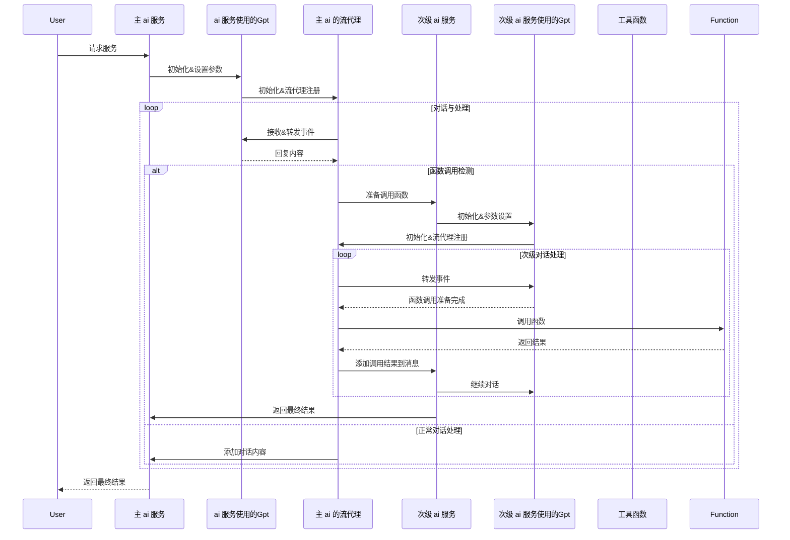

# 函数调用图




# 使用方法

## thrift 文件命名规范
在 `resources/idl/`目录下存放微服务描述相关的 thrift文件,命名必须以”微服务名称.thrift“,其中微服务名称必须和服务注册的微服务名称保持一致，否则无法进行调用

thrift 文件以`// 注释`开头可以向 ai 指明当前微服务的作用，帮助 ai 更好地进行选择函数调用


# Project

## introduce

- Use the [Kitex](https://github.com/cloudwego/kitex/) framework
- Generating the base code for unit tests.
- Provides basic config functions
- Provides the most basic MVC code hierarchy.

## Directory structure

|  catalog   | introduce  |
|  ----  | ----  |
| conf  | Configuration files |
| main.go  | Startup file |
| handler.go  | Used for request processing return of response. |
| kitex_gen  | kitex generated code |
| biz/service  | The actual business logic. |
| biz/dal  | Logic for operating the storage layer |

## How to run

```shell
sh build.sh
sh output/bootstrap.sh
```