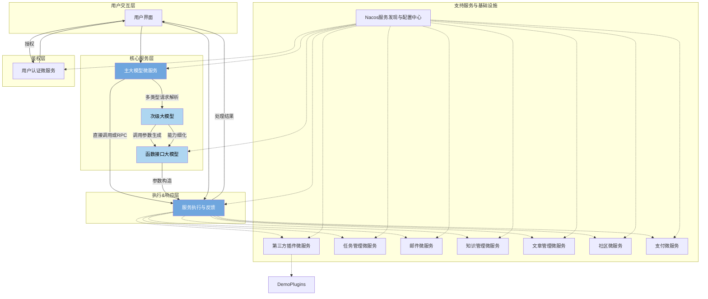

# 项目名称： AN 【智核联动平台】(AIGC Nexus) 

**文档版本：** 1.0

**编制日期：** 2024/07/19

**修订记录：**
- **初稿创建日期：** 2024/07/19

## 项目概述：

构建于AIGC（人工智能内容生成）核心技术之上，我们打造了一个高度灵活且可定制的智能服务平台，该平台采用先进的微服务架构设计，旨在为不同需求的用户提供无缝对接和个性化服务体验。以下是平台运行机制的详细解析：

### **平台概述**

本平台的核心优势在于通过微服务实现了能力解耦与按需定制，用户只需简单配置即可快速接入，享受由智能模型驱动的全面服务。平台以一座桥梁的角色存在着，将复杂的业务逻辑和强大的算力资源紧密连接，促进高效的资源调度和信息流转。

### **模块构成与工作流**

1. **用户界面与主大模型微服务**
    - **用户交互层**：用户通过API接口提交请求，包含自然语言表述的需求。
    - **核心入口——主大模型**：这是系统的第一道处理环节，负责理解与解析用户需求，确定最佳的服务路径。主大模型具备高级的语义理解和决策能力，决定哪些模块微服务最适合响应特定需求。

2. **模块微服务与次级大模型**
    - 每个微服务作为一个“能力模块”，入口配置了另一层大模型，此模型专注识别服务请求类型并映射到合适的内部服务或函数。
    - **需求细化**：次级大模型进一步分析细化用户的具体要求，明确应当调用哪个功能模块及其接口。
    - **调用参数构造**：确定调用需求后，该模型自动生成调用相应接口所需的参数集，确保准确传达用户的意图。

3. **函数接口大模型与服务执行**
    - 最深层次的模型专注于实现调用的细节，包括参数化和错误处理。
    - **判断与反馈**：基于前序分析，此模型验证需求是否符合其管理的接口功能，并作出响应。符合条件则动态生成调用参数；如遇无法处理的情况，则返回精确的错误信息。

4. **主大模型微服务的执行层**
    - 配备了双重调用机制：既能直接通过反射机制执行本地方法，又能通过RPC（远程过程调用）框架与其他微服务通信。
    - **服务调度**：基于分析结果及生成的参数，核心微服务高效地发起实际函数调用，完成用户请求的处理并返回结果。

## 综合优势

该平台不仅优化了资源的利用效率，降低了集成复杂度，更重要的是它以用户为中心设计，从理解需求直达精准执行，大大缩短了服务响应周期，提升了用户体验。通过这一系列智能与技术的完美协同，用户可以轻松接入，享受到量身定制的AI服务，真正实现智能技术应用的广泛便捷与深度个性化。

## 前期目标：
- [ ] 核心架构
  - 用户微服务
  - 主aigc微服务
  - 支付微服务
  - 插件市场微服务
  - 微服务管理微服务
  - nacos服务发现与配置中心
  - 第三方插件微服务（作为demo，吸引更多开发者加入）
    - 任务管理微服务
    - 邮件微服务
    - 知识管理微服务
    - 文章管理微服务
    - 社区微服务
- [ ] 用户微服务
  - 登录、注册、忘记密码、退出登录
  - token分发
  - 第三方登录接入
- [ ] 支付微服务
  - 支付接口
- [ ] aigc微服务
  - 统一的api服务接口，便于后期修改模型
  - 将第三方微服务的模块入口ai和函数入口ai统一封装到aigc微服务中，逻辑上在各个微服务中，物理上统一在aigc微服务中
  - 反射机制
  - rpc调用（动态调用，通过清单去调用，可能需要定义一个统一的接口规范）
  - prompt编辑

## 目标用户群：

目标用户群分析：

### 1. 企业用户
- **技术开发团队**：中小型企业以及大型公司的技术部门，尤其关注于提升工作效率、降低成本的技术解决方案。AN【智核联动平台】可帮助企业快速部署智能服务，无需从零搭建底层AI技术支持，减少研发时间和开支。
- **数字营销部门**：营销团队可以通过平台的AI内容生成能力，快速创作吸引人的广告文案、社交媒体内容、报告分析等，以数据驱动的内容创新提升市场活动效果。
- **客户服务部门**：引入AN平台的智能客服模块，能够大幅度提高应答速度和服务质量，特别是在处理高频率、标准化咨询时表现突出，有助于增强客户满意度和忠诚度。
- **内容创作者**：涵盖自媒体、出版、新闻等领域的内容创作团队，平台可通过个性化内容创作工具，满足创作者对多样性和创意性的需求，如自动生成文章概要、优化标题等。

### 2. 开发者社群
- **个人开发者**：对AI技术和编程有浓厚兴趣的独立开发者，可通过AN平台的开放接口和插件市场，进行技术创新实验，甚至开发新的微服务或功能插件，实现技能增值及盈利。
- **第三方服务供应商**：专业为不同行业提供SaaS服务的技术公司，他们可以通过集成AN平台的功能，丰富自身产品线，如支付提供商、邮件发送服务等。

### 3. 创新创业者
- **初创企业**：特别是专注于AI应用场景探索和商业化尝试的创业公司，平台提供的便捷接入和高度定制化服务，能加速产品原型的迭代和市场验证。
- **数字化转型企业**：那些正在经历数字化升级转型，希望利用AI技术优化运营流程、提升产品智能化水平的企业。

### 4. 教育与研究机构
- **高校与研究单位**：教育研究人员可以借助平台的开源精神和技术接口，进行AI相关的教学实践、科研项目和应用研究，促进学界与业界技术交流。

### 5. 个人用户
- **内容消费者**：虽然AN平台主要面向B端和开发者，但通过企业或创作者使用平台产生高质量内容的个人用户，也将间接从中受益，如阅读定制资讯、享受更加人性化的在线服务等。

## 应用场景案例

> 淘宝借助AN【智核联动平台】实现实时商品推荐下单自动化

### **背景**
设想淘宝希望提升其在线商店的顾客体验与销售效率，计划利用前沿的人工智能技术自动根据顾客的具体需求推荐最优商品，并实现一键下单的功能。开发者希望在不增加额外人力资源负担的情况下，简化顾客的购买流程，提高转化率。

### **接入方案**

1. **准备阶段**：
    - **接口清单准备**：开发者基于现有的系统架构整理出用于商品查询、详情获取、添加至购物车及最终下单等操作的RPC接口清单。该清单详细列出了每个接口的功能、函数名、参数类型和预期返回值。  【通常使用protobuf(.proto)文件格式规范定义,无需开发者重复列出清单】。

2. **部署微服务**：
    - **私有部署**：开发者可以选择在自有的Kubernetes (K8s) 集群中私有化部署AN【智核联动平台】，以保护数据安全和保持系统集成的灵活性，或使用AN平台在公有云上已部署好的微服务。 【按照部署费用一次性收费，后期大版本升级也可收费】
    - **公有部署**：若选取共有化部署，开发者需向AN平台申请专用的API密钥进行鉴权，同时将上述RPC接口开放给AN平台，确保在安全的通道上实现双方系统的互通。 【按照调用次数收费】

3. **前端集成**：
    - 开发者仅需在自己的淘宝店铺网页或APP中增加一个交互式聊天窗口组件。当顾客提出问题或表达购买意向时，这些输入会被发送到AN平台的核心大模型处，启动自动化流程。

4. **AI执行逻辑示例**：
    - 用户：“我需要一条夏日穿着的轻薄连衣裙，适合户外活动。”
    - AN平台主大模型接收到指令后，通过自然语言理解分析用户需求，确定“夏日”、“轻薄”、“连衣裙”以及“户外活动”为关键词，随后激活商品推荐微服务对应的接口。
    - 商品推荐微服务根据关键词在开发者的商品库中筛选合适的商品，并调用详细信息获取接口，整理成易于阅读的文本或图像信息回馈给用户。
    - 用户确认后，直接在聊天窗口通过自然语言发出“我要这件，立即购买”的指令，AI自动调用加入购物车与下单的接口，完成交易流程。

### **最终效果**
通过接入AN【智核联动平台】，开发者无需深入了解复杂的AI算法或承担大量代码开发工作，仅仅通过前端集成一个聊天窗口，就能实现高效、个性化的商品推荐以及自动下单的智慧购物体验。整个过程由AI驱动的自动化服务极大提升了用户体验和商业效率，展现出智能技术在电商领域的巨大潜力。

- **技术架构：**

- **前端**：用户界面设计友好、易于操作的API管理面板,基于 React 或者 Vue。
- **后端**：微服务架构，确保服务的高可用性和可扩展性，使用 k8s 集群搭建，包含多种语言，主要为 go，其次是 java，使用 proto 生成工具保证多语言接口的一致性。
- **核心引擎**：利用深度学习框架（如TensorFlow、PyTorch）构建AIGC模型，前期没有资源，可以暂时使用api 接口调用第三方模型实现，但是必须要定义接口，后期有资源后实现接口即可。
